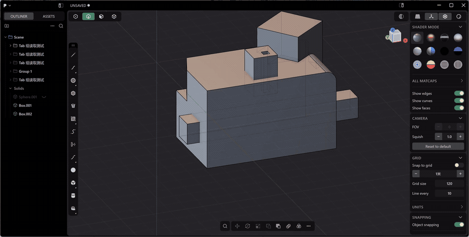

  

<h1 align="center">Plasticity Asset Tool</h1>

把常用模型变成组件，在 Plasticity 内浏览、保存与置入。

  <a href="https://github.com/mianxiu/plasticityassettool/releases">下载 Windows 发布包</a> ·
  <a href="https://github.com/mianxiu/plasticityassettool/wiki/Plugin-Installation">安装说明</a> ·
  <a href="https://github.com/mianxiu/plasticityassettool/wiki">使用文档</a> ·
  <a href="TODO.md">开发计划</a>

Plasticity 本地模型组件库：把常用实体、曲线和组合模型保存下来，在建模视口中直接复用。

## 特色功能

- **原生置入**：点击缩略图，在 Plasticity 视口定位、旋转、缩放并确认；默认保存与置入不占用系统剪贴板。
- **3D 预览与基点**：旋转查看模型，编辑基点与方向，支持 Plasticity 原生精确拾取及自定义缩略图。
- **布尔与连续布尔组**：独立对象、合并、减去、相交；组合组件可按顺序完成多步运算。
- **本地资产管理**：按库、分组、分类和标签组织组件，支持搜索、归档、批量 ZIP 导入与冲突处理。
- **备份与迁移**：整库备份、恢复前预览和自动回滚备份。

## 操作演示

## 开始使用

当前验证环境：**Windows x64 / Plasticity 26.1.3**。下载完整发布包，运行启动器，在控制中心安装插件；按 **Tab** 打开或关闭组件库。

[下载安装](https://github.com/mianxiu/plasticityassettool/wiki/Plugin-Installation) · [使用指南](https://github.com/mianxiu/plasticityassettool/wiki) · [常见问题](https://github.com/mianxiu/plasticityassettool/wiki/FAQ) · [源码运行](https://github.com/mianxiu/plasticityassettool/wiki/Development)

本项目为非官方工具，安装会修改 Plasticity 入口并保留恢复备份。使用前请阅读 [第三方声明与使用风险](DISCLAIMER.md)。

公众许可为 **GPL-3.0-only**；Plastic Software LLC 的独立替代授权及历史许可说明见 [许可证说明](docs/Licensing.md)。
